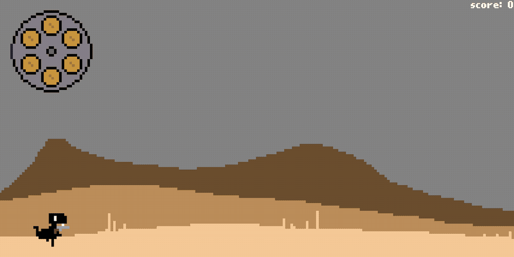
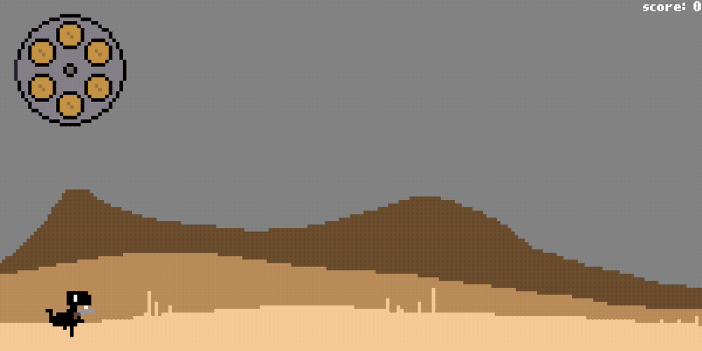
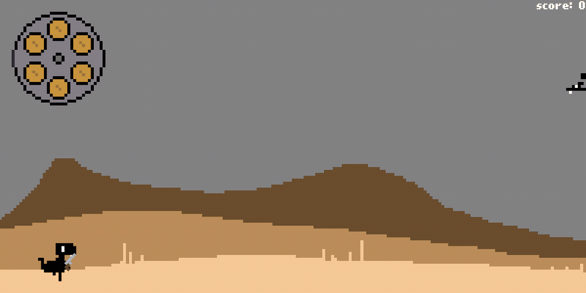
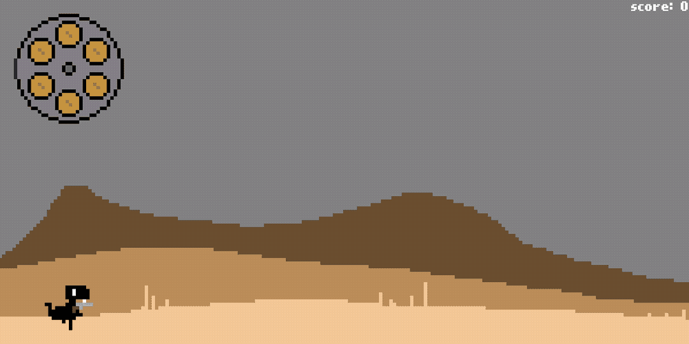

# Dino Jump

## This time Dino came strapped.

Press `G` to shoot the gun and give those cacti a fatal dose of lead. Watch out though, shooting cacti lowers your
score.

Use the arrow keys to angle your gun:

You can use this to shoot Dino's mortal enemy: Pterodactyl. Popping a pterodactyl nets you 100 points.

Those are the controls. If you forgot any of that, just hit escape to see this sweet pause menu, complete with dino claw
cursor that does ___absolutely nothing___.

Sometimes even a rain of hot lead can't stop the cacti. If Dino bites the dust, be sure to enter his/her name in the
highscores.

Just don't put a space in the name; that'll start a new game. It's a bug. I'm working on it. Give me a break, I built
all this from scratch including the text input field. 
